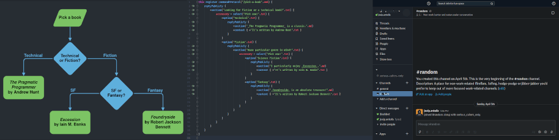

# Serious callers only

A declarative framework for building [Slack bots](https://api.slack.com/).

## Table of contents

- [Introduction](#introduction)
- [Technologies](#technologies)
- [Install](#install)
    - [Prerequisites](#prerequisites)
    - [Build](#build)
- [Usage](#usage)
    - [Scripting](#scripting)
    - [Running](#running)
    - [Slack config](#slack-config)
- [Project status](#project-status)
- [Authors](#authors)
- [License](#license)
- [Acknowledgements](#acknowledgements)

## Introduction



Slack provides a powerful API for building integrations and bots. However, a lot of interactions include writing callback code.  In case of multiple chained interactions it can be difficult to track state of the conversation between individual callbacks. Serious callers only (_Callers_ for short) aims to help with this.

The Callers framework draws inspiration from declarative UI frameworks such as [Rect](https://reactjs.org/) and [Flutter](https://flutter.dev/). It provides you with two distinct components:

- A [DSL](https://en.wikipedia.org/wiki/Domain-specific_language) for writing your bot's logic.
- A runtime that will run your DSL scripts against Slack API.

## Technologies

Callers framework itself is developed in [Kotlin](https://kotlinlang.org/). It leverages Kotlin's [type-safe builders](https://kotlinlang.org/docs/reference/type-safe-builders.html) features to define it's DSL. Further more it uses Kotlin's [scripting support](https://github.com/Kotlin/KEEP/blob/master/proposals/scripting-support.md) to offer a coding environment in [IntelliJ IDEA](https://www.jetbrains.com/idea/). Lastly, the runtime component is wrapped in a [Spring Boot](https://spring.io/projects/spring-boot) application, packaged as a [Docker](https://www.docker.com/) image. This enables you to easily write your scripts with IDE support and ship them in a pre-built runtime environment, ready for deployment.

## Install

For now, you'll need to locally build the framework in order to try it out.

### Prerequisites

You will need locally installed Java in order to either build the framework or write call scripts. Framework itself compiles to Java version 1.8 (in order for the IntelliJ support to work). I suggest using [Open JDK](https://openjdk.java.net/install/) for your development needs.

Additionally, if you are interested in packaging your scripts as a Docker image you'll also need to [install Docker](https://docs.docker.com/get-docker/).

### Build

Open a terminal inside the project root directory and run:

```shell script
./gradlew clean build publish docker
```

This will:

1. Build the project by pulling its dependencies, compiling the code and running tests.
1. Publish the DSL library as a maven package in your local repository (usually found under `~/.m2` directory).
1. Build a docker image for the Spring boot app that's wrapping the framework runtime.

Produced artifacts:

- Maven package for the DSL: `hr.from.josipantolis.seriouscallersonly:api:0.1.0-SNAPSHOT`
- Docker image for runtime: `hr.from.josipantolis/serious-callers-only:latest`

## Usage

### Scripting

You can write your Serious callers only scripts in 2 ways:

1.  Using a provided DSL library to [declaratively](https://en.wikipedia.org/wiki/Declarative_programming) define bot behaviour.
1.  Using exposed underlying classes to [imperatively](https://en.wikipedia.org/wiki/Imperative_programming) build the bot.

#### Declarative approach

Example of DSL using script:

```kotlin
this register botJoinedChannelReplier { (channel, _) ->
    replyPublicly {
        +section("Hello there!".txt)
        +context {
            +"Posted in ${channel.mention}".md
            +"Channel id: `${channel.id}`".md
        }
    }
}
```

This will make the bot post _Hello there!_ in every channel it joins.

For more examples take a look at:

- [DeclarativeBookPicker.call.kts](./example/src/scripts/books/DeclarativeBookPicker.call.kts) for an example of a script that defines a slash command for picking a net book to read.
- [ShowOff.call.kts](./example/src/scripts/ShowOff.call.kts) for a script that's showcasing all available message formatting features of the framework.

#### Imperative approach

The same _Hello there!_ script from the previous section can be written programmatically as:

```kotlin
register(EventReplier.BotJoinedChannelReplier { (channel, _) ->
    Reply.Message(
        blocks = listOf(
            Block.Section(
                text = Element.Text.Plain("Hello there!")
            ),
            Block.Context(
                elements = listOf(
                    Element.Text.Markdown("Posted in ${channel.mention}"),
                    Element.Text.Markdown("Channel id: `${channel.id}")
                )
            )
        )
    )
})
```

Both scripts will result in the same bot behavior.

For more examples of imperative style take a look at:

- [ImperativeBookPicker.call.kts](./example/src/scripts/books/ImperativeBookPicker.call.kts) which offers an imperative implementation of the book picker command.
- [PlayCommand.call.kts](./example/src/scripts/PlayCommand.call.kts) for an example of a rich interaction bot that can play Tic Tac Toe and a guessing game.

### Running

When it comes to packaging and running your call scripts you again have 2 options:

1. You can write only the bot scripts and run them using the provided Serious Callers Only docker image.
1. Or you can use the runtime library and incorporate it in your own Kotlin or Java app.

The provided [example project](./example) in this repository showcases the first approach. That one is generally quicker to implement, and it allows you to focus on defining your bot's behavior. If you pick this approach you'll need to:
 
 - [Declare a dependency](./example/build.gradle.kts) on DSL library.
 - Store your scripts in files with `*.call.kts` extension.
 - Run the scripts with [docker run](./example/README.md).
 
 When you run the Serious Callers Only docker image it will expose 2 sets of endpoints:
 - `http://localhost:3000/slack/events` which can be used as a webhook for Slack events.
 - `http://loalhost:3001/actuator` which runs [Spring Actuator](https://docs.spring.io/spring-boot/docs/current/reference/htmlsingle/#production-ready) endpoints that you can use to monitor the state of your app. In addition to standard actuator stuff the Callers app adds 2 extra endpoints:
    - `/actuator/bot` will list all features of currently running bot
    - `/actuator/conversations` will list all currently ongoing conversations that your bot is engaged in

The second approach is implemented in the [app module](./app) of this project. That is the Spring Boot app that is packages into the Serious Callers Only docker image. You can take the same approach if you already have or anticipate needing a full-blown app around your scripts. In this case you may not need to write the call scripts in their own files. All you need is to:

- Instantiate the [`hr.from.josipantolis.seriouscallersonly.api.Bot`](./api/src/main/kotlin/hr/from/josipantolis/seriouscallersonly/api/Bot.kt) class with your bot's behavior.
- Provide the bot to [`hr.from.josipantolis.seriouscallersonly.runtime.slack.BotKt::slackApp`](./slack-runtime/src/main/kotlin/hr/from/josipantolis/seriouscallersonly/runtime/slack/Bot.kt) method that will set up the runtime.
- `slackApp` method will return an instance of `com.slack.api.bolt.App` that you can then use to [run the bot](https://slack.dev/java-slack-sdk/guides/getting-started-with-bolt).

When starting your bot locally you'll still need a public URL endpoint that will be accessible to Slack servers. For this you can use [ngrok](https://ngrok.com/). It's a tool for exposing your local server on a temporary domain on the public internet. It will also provide an HTTPS endpoint, which is required by Slack. 

### Slack config

No matter how you choose to implement or run your Callers powered bot, you'll need to configure it on Slack itself. The framework currently doesn't support installation to multiple workspaces, so auth is based on bot token.

To configure your bot:
1. Visit [Slack App configuration](https://api.slack.com/apps) page.
1. Create a new app (or pick one that already exists)
1. Go to _Basic Information_ (in the left menu) > _Add features and functionality_. Copy the _Signing Secret_ from this page and:
    1. Enable _Interactive Components_ by providing it with your apps public URL. If you are running the Serious Callers Only docker image and exposing it via ngrok your URL will be: `https://[some-hash].ngrok.io/slack/events`.
    1. Define _Slash Commands_ in case your bot exposes them. Your URL will be the same as in the previous step.
    1. Enable _Event Subscriptions_ and subscribe to following bot events:
        - `member_joined_channel`
        - `message.channels`
        - `message.groups`
        - `message.im`
        - `message.mpim`
    1. Enable _Permissions_. Copy the _Bot User OAuth Access Token_ from this page and add following _Bot Token Scopes_:
        - `channels:history`
        - `channels:join`
        - `channels:read`
        - `channels:write`
        - `chat:write`
        - `commands`
        - `groups:history`
        - `groups:read`
        - `im:history`
        - `mpim:history`

After this your Slack config should be filled, and you should have _Signing Secret_ and _Bot User OAuth Access Token_. You'll need to provide those values to the framework runtime. If you're running the docker image just set them as environment variables.

## Project status

The Serious Callers Only is in early development phase. It's operational, but not yet production worthy. At this stage my goals are to:

1. [] Validate the idea by building some larger projects with the framework.
1. [] Add plugins to call scripts that will enable easy integration with stuff like Git repos, CI pipelines, Task trackers, Wikis, etc. 
1. [] Add support for Slack Modals and Home tab.

Despite the early stages of the project, it does adhere to [semantic versioning](https://semver.org/). Currently, project is in per-release phase (with versions in `0.y.z` range), so you can expect some breaking changes to the API.

## Authors

- Josip Antoliš - _Initial development_ - [Antolius](https://github.com/Antolius)

 ## License
 
 Distributed under the MIT License. See `LICENSE.txt` for more information.
 
## Acknowledgements

None of this would be possible without wonderful folks over at [Slack](https://github.com/slackapi), and particularly the [slack-java-sdk](https://github.com/slackapi/java-slack-sdk).

Almost as crucial are the devs from [JetBrains](https://github.com/JetBrains) with their various Kotlin language features and scripting support on IntelliJ IDEA side.

Lastly, I've learned a great deal from [Rodrigo Oliveira's](https://github.com/bamboo) [Implementing the Gradle Kotlin DSL](https://youtu.be/OEFwnWxoazI) Kotlinconf 2019 talk.

      
